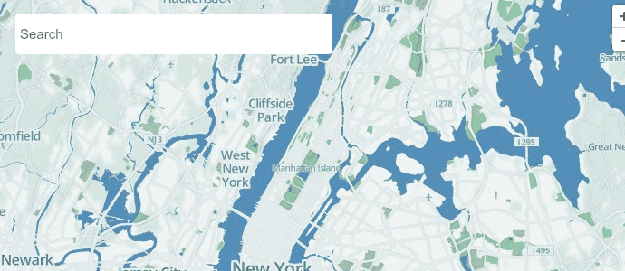
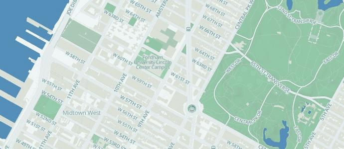
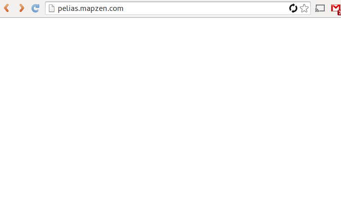
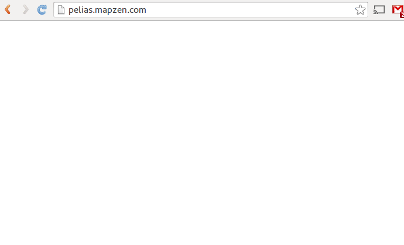
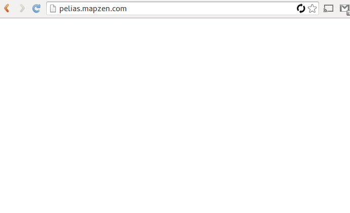

Pelias is a modular open-source geocoder built on top of ElasticSearch for fast geocoding. 

### What's a geocoder do anyway?

Geocoding is the process of transforming input text, such as an address, or a name of a place—to a location on the earth's surface.

### ... and a reverse geocoder, what's that?

Reverse geocoding is the opposite, it transforms your current geographic location in to a list of places nearby.

### What makes Pelias different from other geocoders?

- It's completely open-source and MIT licensed
- It's based on open-data, so you can run it yourself
- You can install it locally and modify to suit your needs
- It has an impressive list of features, such as fast autocomplete
- It's modular, so you don't need to be an expert to make changes
- It's easy to install and requires no external dependencies
- We run a continuous deployment cycle with a new version shipping weekly

### What are the main goals of the Pelias project?

- Provide accurate search results
- Give users query suggestions (typeahead in the search box)
- Account for location bias (places nearer to you appear higher in the results)
- Support multiple data sources (OSM, geonames, quattroshapes etc)
- Flexible software architecture
- Easy to contribute software patches and features to
- Easy to set-up and configure your own instance
- No external dependencies (such as postgres)
- Reliable, configurable & fast import process
- Work equally well for a small city and the entire planet

### I'm a developer, can I get access to the API?

Pelias was rebuilt from scratch and re-launched at the end of Sept '14 so the API is still in Alpha and will be subject to change for the rest of the year.

You don't need a key to access the demo API, however we are enforcing some generous rate limits. If you need help building your own Pelias server get in touch!

#### /suggest

The suggest endpoint provides a super-fast autocomplete. This API can be used to quickly find location names which BEGIN with the input text.

You must provide a latitude and longitude so that the results are localised, you may additionally provide a zoom value.

http://pelias.mapzen.com/suggest?input=big%20ben&lat=51.5&lon=-0.06

#### /search

The search endpoint provides a full-text search. This search is far more flexible than `/suggest`. It will try to account for spelling mistakes and will search for your input at any position in the location name.

You must provide a latitude and longitude so that the results are localised. You may additionally provide a zoom value.

http://pelias.mapzen.com/search?input=shoreditch&lat=51.5&lon=-0.06

#### /reverse

The reverse endpoint returns the nearest locations to your input lat/lon.

You must provide a latitude and longitude so that the results are localised. You may additionally provide a zoom value.

http://pelias.mapzen.com/reverse?lat=51.5&lon=-0.06h

### Contributing

If you would like to report a problem please [open an issue](https://github.com/pelias/pelias/issues).
Pull requests are welcome!

